## PUC-Eng-Dados-MVP
### MVP de Engenharia de dados PUC
[Clique aqui para acessar o Notebook com os códigos, resultado de queries e gráficos](https://databricks-prod-cloudfront.cloud.databricks.com/public/4027ec902e239c93eaaa8714f173bcfc/2149961212973897/667217794031682/3413641925918938/latest.html)

## PUC-Eng-Dados-MVP
#### 1 - Objetivo: Objetivo.
De janeiro de 2020 até dezembro de 2021 o mundo se viu numa revolução devido a pandemia da COVID-19. Em pouco tempo, vimos mudanças drásticas na mudança de hábito, medo, morte e instabilidade econômica. O que antes era considerado normal, em um piscar de olhos se tornou perigoso. Vivíamos a era do "novo normal". 
Este tema, devido a estes e outros fatores, despertou a minha curiosidade por isso o elegi como objeto de meu estudo para, pelo menos tentar responder com dados, algumas perguntas que ficaram na minha mente neste período. 

Além de tentar me ajudar com estas dúvidas o trabalho tem como objetivo entender como ficou a distribuição dos casos reportados (Brasil e mundo), distribuição da taxa mortalidade (Brasil e mundo) e eficácia das vacinas.

Desta forma elaborei as seguintes perguntas:

1. Qual foi a taxa de mortalidade da COVID-19 por milhão de pessoas no mundo?
2. Esse número flutuou ao ser comparado com os índices brasileiros?
3. Qual a localidade com o maior número de casos reportados?
4. O número de casos teve variação entre os países?
5. Variação entre o Brasil e o mundo sobre a quantidate de pessoas hospitalizadas X mortes. 
6. Tempo entre a primera dose administrada no mundo X Brasil.
7. Ritmo de vacinação por país.

#### 2 - Coleta:
Os dados utilizados para a análise foram coletados do site https://ourworldindata.org/, que já na pendemia da COVID-19 os disponibilizava de forma pública e gratuita. O site é fruto de um projeto da parceria entre a Universidsde de Oxford, responsável pelas pesquisas  e uma ONG chamada Global Change Data Lab que é responsável pela manutenção do site.
O período utilizado para realizar o MVP foi de março de 2020, período em que foi decretado o "Lock Down" até a dezembro de 2021 quando a maioria das pessoas no mundo já haviam recebido as doses das vacinas e a pandemia estava controlada.
Os arquivos baixados foram os seguintes:
- daily-new-confirmed-covid-19-cases-per-million-people
- daily-new-confirmed-covid-19-deaths-per-million-people
- number-of-covid-19-patients-in-hospital-per-million-people
- daily-covid-19-vaccine-doses-administered-per-million-people

#### 3- Modelagem.

Baseado na características dos dados coletados, o esquema **estrela** escolhido para a modelagem, pelas seguintes razões:

1. **Nível de normanlização apropriado**:

2. **Performance das Queries**:
  
3. **Representação Intuitiva**:

4. **Flexibilidade**

**Abaixo a imagem de como ficou o modelo:**

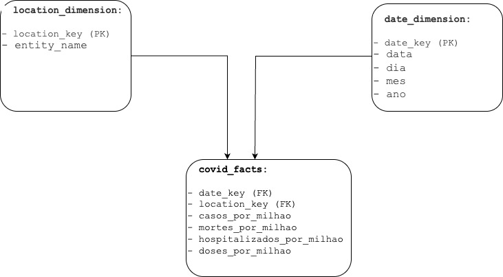

##### Catálogo de Dados:
1. Tabela location_dimension: Com as seguintes colunas: 
  * location_key(PK) Inteiro: Número inteiro e único na tabela que indica a localidade.
  * entity_name:String
    * Nome da localidade, não é necessariamente um país. Pode ser por exemplo, um continente, ou Mundo menos China, etc.

2. Tabela date_dimension: Com as seguintes colunas:
  * date_key (PK) Inteiro: Número inteiro e único na tabela que indica uma data específica
  * data Date: Traduz o date_key para um formato mais amigável
  * dia Inteiro: Dia do mês
  * mes Inteiro: Mês do ano
  * ano Inteiro: Ano

3. Tabela covid_facts: Com as seguintes colunas:
  * date_key (FK) Inteiro: Para correlação com a tabela date_dimension.
  * location_key (FK) Inteiro: Para correlação com a tabela location_dimension.
  * casos_por_milhao Decimal(10,4): Número de casos reportados por milhão de pessoas.
  * mortes_por_milhao Decimal(10,4): Número de mortes reportadas por milhão de pessoas.
  * hospitalizados_por_milhao Decimal(10,4): Número de pessoas hospitalizadas reportadas por milhão de pessoas.
  * doses_por_milhao Decimal(10,4): Doses administradas de vacina reportados por milhão de pessoas.

#### 4 - Carga. 
##### 4.1 - Extração - Montagem do banco de dados 
##### 4.2 - Carga dos dados
###### Criação das tabelas bronze - Dados originais,sem alteração.
##### 4.3 - Transformação dos dados:

[Clique aqui para acessar o Notebook com os códigos, resultado de queries e gráficos](https://databricks-prod-cloudfront.cloud.databricks.com/public/4027ec902e239c93eaaa8714f173bcfc/2149961212973897/667217794031682/3413641925918938/latest.html)

#### 5 Análise.
##### 5.1 - Respondendo perguntas
###### 5.1.1 - Qual foi a taxa de mortalidade da COVID-19 por milhão de pessoas no mundo?
###### R: Taxa de mortalidade mundial 0.014

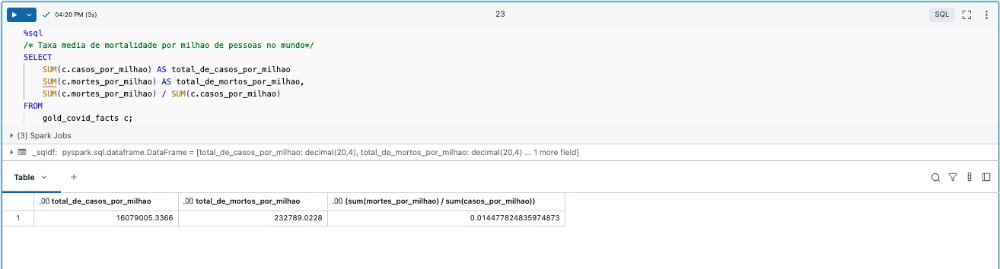

###### 5.1.2 - Esse número flutou ao ser comparado com os índices brasileiros?
###### R: Sim - A taxa brasileira foi bem maior que a mundial, 0.028 contra 0.014, ou seja, o dobro.

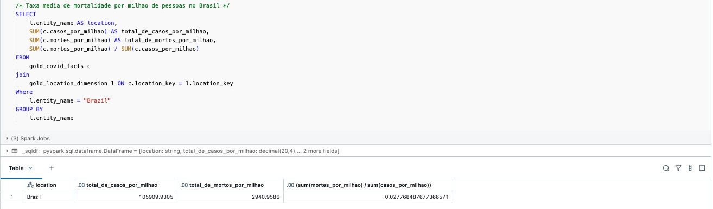
###### 5.1.2.1 - Expansão da pergunta - Esse número flutuou ao ser comparado com os índices brasileiros? As taxas brasileiras, estão entram as 15 maiores do mundo? 
###### R: Não. Analisando os 15 países com as maiores taxas de mortalidade, as brasileiras são bem menores em comparação com a 15 lugar, North Macedonia, com 0.37. Há dois países da América Latina com taxas bem superiores, como México com 0.076 e Peru com 0.089.  

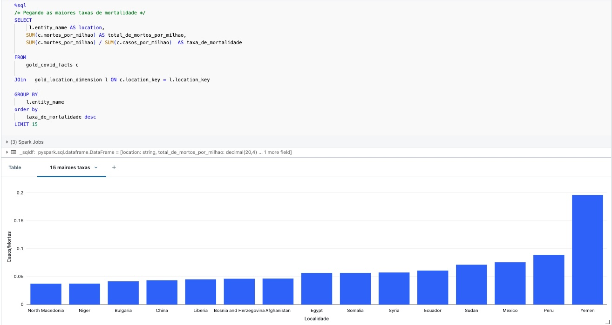

###### 5.1.2.2- Expansão da pergunta - Esse número flutuou ao ser comparado com os índices brasileiros? As taxas brasileiras, estão entram as 15 menores do mundo?
###### R: Não. Analisando os 15 países com as menores taxas de mortalidade, as taxas brasileiras (0.028) são bem maiores em comparação com a 15 lugar, Bahrain (0.005).

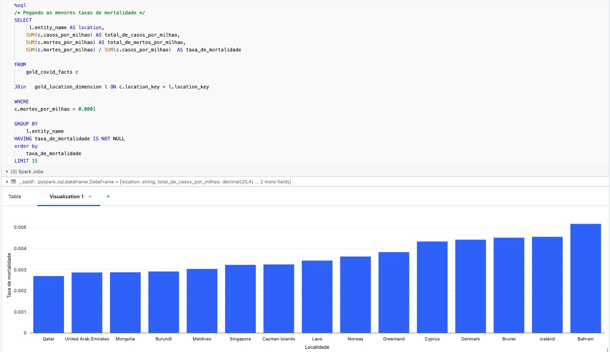

###### 5.1.3 - Qual a localidade com o maior número de casos reportados?
###### R: Andorra
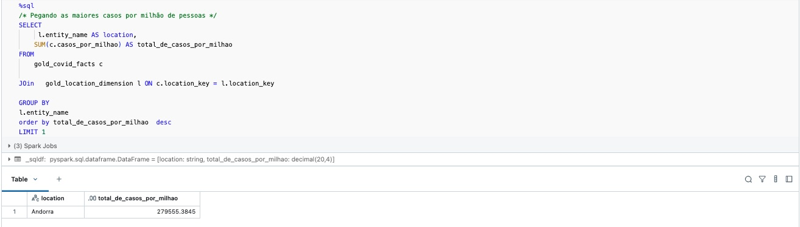

###### 5.1.4 O número de casos teve variação entre as localidades? 
###### R: Sim, uma flutuação enorme 279.555 (Andorra) casos contra 9 (Samoa) no entanto isso se torna irrelevante devido a tamanho da população das localidades.

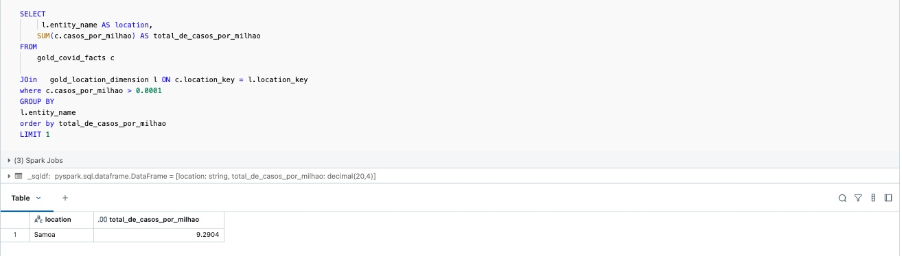

###### 5.1.4.1 Expansão da pergunta -  O número de casos teve variação entre os localidades? E com relação ao Brasil?  
###### R: Brasil ficou bem abaixo com 105.909 casos em comparação com os de Andorra 279.555. Porém esta não é uma comparação justa devido à disparidade, principalmente populacional, entre as localidades.

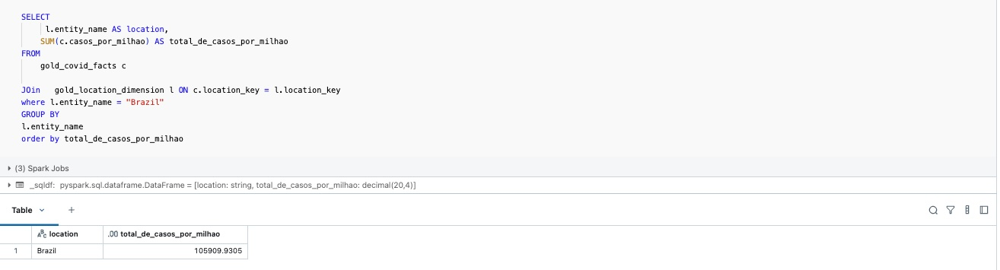

###### 5.1.4.2 Expansão da pergunta - O número de casos teve variação entre as localidades? Tá, mas e a relação do Brasil com localidades semelhantes em termos de população, cultura e com a China que foi a origem da pandemia?
###### R: Espanta a quantidade de casos reportados pela China (país de origem da pandemia) contra as demais localidades. Brasil e Europa quase equivalentes, mas há um aumento razoável de casos quando se compara com os E.U.A.

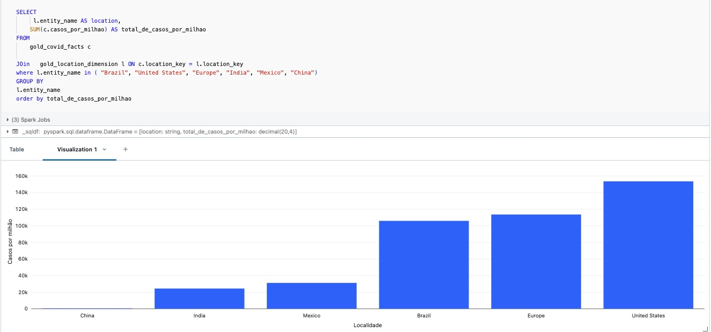

###### 5.1.4.3 Expansão da pergunta - O número de casos teve variação entre as localidades? OK, mas e as taxas de mortalidade comparadas com localidades semelhantes em termos de população, cultura e com a China que foi a origem da pandemia?
###### Outro espanto, China com alta taxa com relação aos casos. Brasil esperadamente acima de Estados Unidos e Europa o que índica fragilidade no sistema público de saúde, pois a quantidade de casos é relativamente próxima. Se comparado ao México, por ser latino e de dimensões semelhantes às brasileiras ficamos bem atrás em relação à taxa de mortalidade, este número que se torna ainda mais expressivo pelo fato do México ter tido apenas 1/3 dos casos reportados por milhão de pessoas.

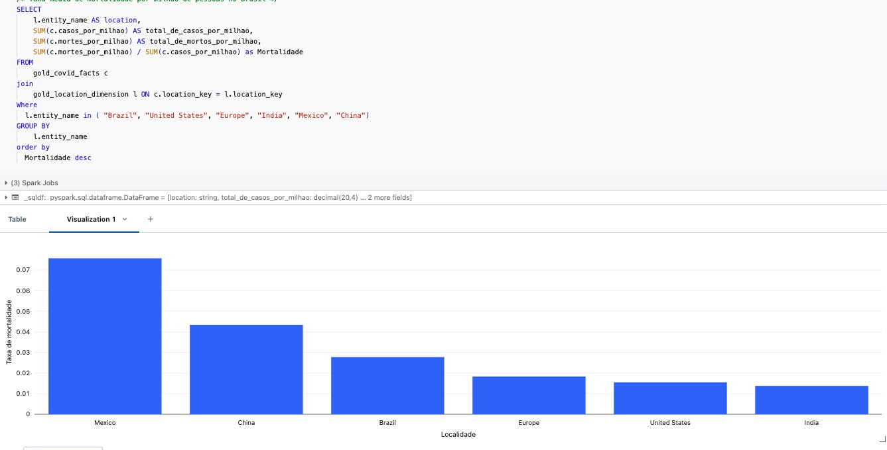

###### 5.1.5. Variação entre o Brasil e o mundo sobre a quantidate de pessoas hospitalizadas X mortes.
###### R: Não pode ser respondida, porque não há dados sobre hospitalizados no Brasil.
###### 5.1.6. Tempo entre a primeira dose administrada no mundo X Brasil.
###### R: A diferença é grande entre a primeira dose dada no mundo (oito de dezembro de 2020 na Noruega) e a primeira dose no Brasil (18 de janeiro de 2021), mais de 40 dias. 
###### OBS. A data foi extraída a partir do momento em que a contagem de doses passou a ser maior que 0.0001 por milhão de pessoas, logo pode haver uma pequena variação nas datas efetivas. 

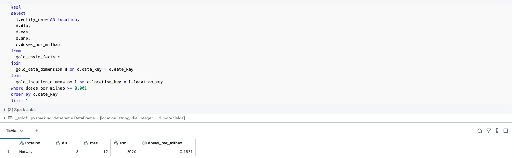
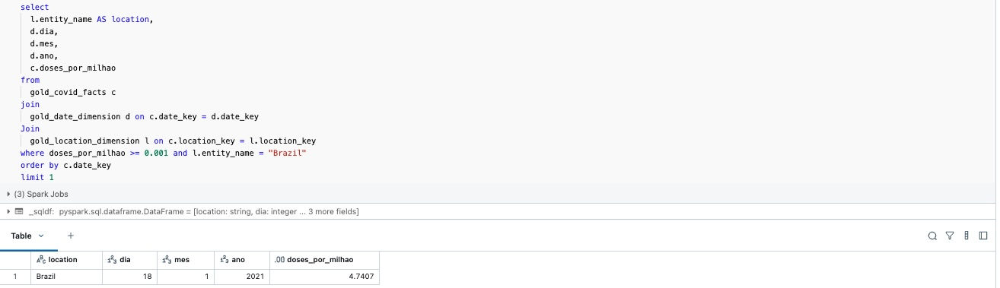

###### 5.1.7. Ritmo de vacinação por país.
###### R: Aqui, foi usado o mesmo parâmetro de escolha das localidades para comparação. Localidades semelhantes em termos de população, cultura e a China que foi a origem da pandemia. Alguns pontos interessantes:
###### 1. Estados Unidos com ritmo muito forte até abril(2021), depois começa a cair até novembro (2021) quando há um leve aummento mantendo-se estável até o fim do período de medição.
###### 2. O ritmo do Brasil, é bom até abril (2021) quando para de crescer. Cai em maio(2021) e volta forte em junho (2021). Se mantém até agosto (2021) quando começa a diminuir até o final do período.
###### 3. China tem um crescimento muito grande em maio (2021) que coincide com a queda de vacinação nos E.U.A. Se mantém forte até setembro (2021). Quando começa a cair, em novembro(2021) volta a crescer e tem um pico em dezembro (2021).

###### Convido para fazerem suas próprias manipulações, clicando em cada uma das localidades, incluindo ou removendo-a do gráfico.

###### Convido para fazerem suas próprias manipulações, clicando em cada uma das localidades, incluindo ou removendo-a do gráfico.

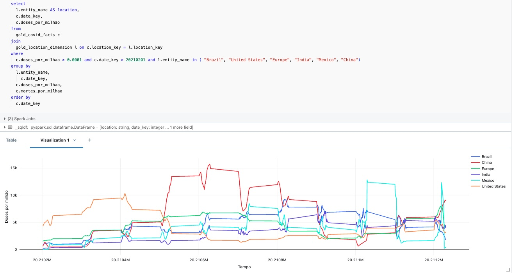

###### 5.1.7. Ritmo de vacinação por país - Expansão da pergunta
###### Aqui é um cruzamento entre o ritmo de vacinação contra a taxa de mortalidade. Interessante ver como o aumento das doses diminui a quantidade de mortalidade

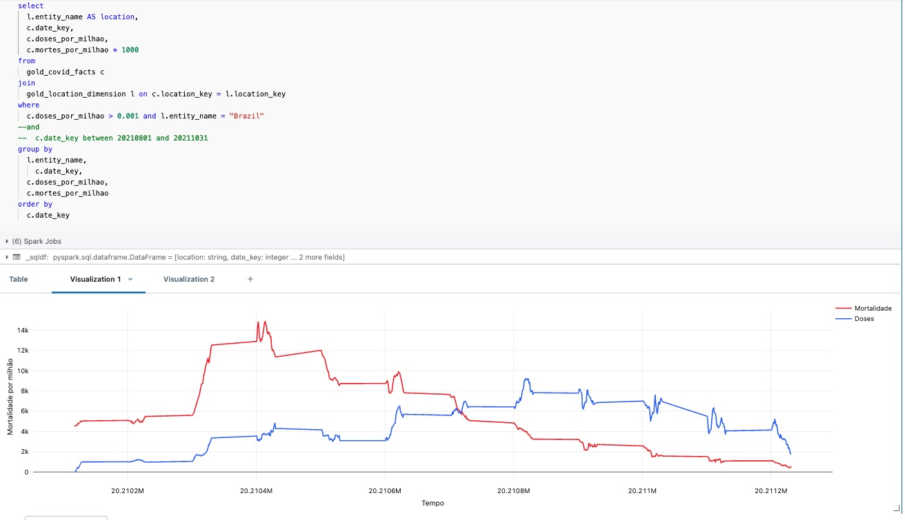

##### 6. Discussão Geral.
##### A pandemia da COVID-19 causou um impacto muito grande no mundo, consegui tirar como conclusão que o que mais matou não foi a taxa de contaminação em si, mas o nível de preparo dos países com relação aos seus sistemas de saúde, frágeis em países em desenvolvimento como o Brasil. 
##### A taxa de contaminação variou bastante entre as localidades, sendo alta até mesmo em localidades mais desenvolvidas como, E.U.A e Europa. Por outro lado, foi surpreendentemente baixa na China, origem do vírus.
##### As vacinas foram super importantes para o fim da pandemia, mas houve um determinado período onde os países em desenvolvimento não conseguiram manter um ritmo adequado, muito provavelmente devido à alta demanda das localidades que de fato produziram suas vacinas, como a Europa com a AstraZeneca, Pfizer e Janssen nos E.U.A, e Corona-Vac na China.

##### 7. Autoavaliação

Creio que consegui atingir os objetivos delineados, me guiei pelo paragrafor de "Critérios de valiação" no final da página tentei ser o mais literal possível com relação à eles.
 
Minha maior dificuldade foi no começo do trabalho onde tive que definir o tema e como faria para conduzir a analise em si.
 
Sobre a parte técnica, confesso que não foi um grande problema, creio que consegui superar bem os desafios propóstos apeser de ter me deparado com ferramentas que eu não conhecia, como DataBricks e PySark.
 
Senti falta de encontros síncronos, não com relação ao MVP, mas no que diz respeito as disciplinas, alí enfrentei o seguinte problema: lia, entendia, mas não conseguia concretizar o conhecimento, gosto muito de confirmar o entendimento após  o aprendizado de temas mais sensíveis e isso não ocorreu durante a sprint.

